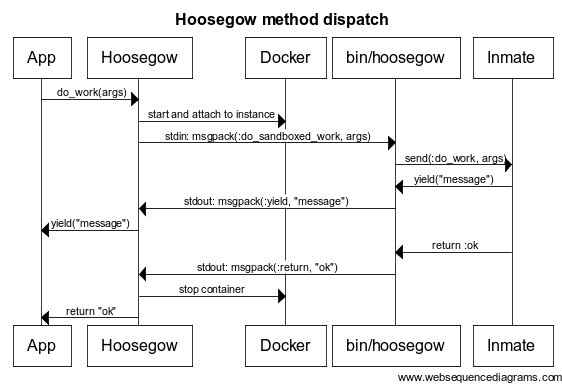

# Hoosegow dispatch

Calling a method on an inmate involves passing information through several layers. The participants in the flow are:

* **App** - your app's code, outside of the container.
* **Hoosegow** - an instance of the `Hoosegow` class, created outside the container.
* **Docker** - the docker daemon.
* **`bin/hoosegow`** - the entry point in the docker container.
* **Inmate** - an instance of the `Hoosegow` class, inside the container, that has included `Hoosegow::Inmate` (your sandboxed code).

## Interfaces

### Hoosegow (outside the container)

The outer instance of `Hoosegow` receives a normal call from the application.

It encodes the method name and arguments and provides that to an attach call to Docker.

It reads the Docker response as it comes in. It demultiplexes the docker output into `STDERR` and `STDOUT`. `STDOUT` is further decoded into the actual `STDOUT` from the Inmate, `yield` calls, and the method result.

### Docker

Docker receives an HTTP POST with a body, and returns an HTTP response with a body. The HTTP request body is treated as `STDIN`, and the response body contains `STDOUT` and `STDERR`.

See [documentation for attach](https://docs.docker.com/engine/api/v1.40/#operation/ContainerAttach).

### bin/hoosegow

`bin/hoosegow` is started by Docker when the container starts. It is the entry point of the container.

It decodes `STDIN` and calls the requested method on the Inmate.

`STDOUT` is reopened so that we can encode a few things on it:

* normal stdout from the inmate or child processes spawned by the inmate
* data that is `yield`ed
* the return value from the inmate.

`STDERR` is left as-is.

### Inmate

The Inmate is an object that includes the `Hoosegow::Inmate` module.

Input to the Inmate is a method name and arguments.

Output from the Inmate can be spread across several things:

* `STDOUT` and `STDERR` - e.g. puts calls 
* `yield` to a block
* the result of the method
